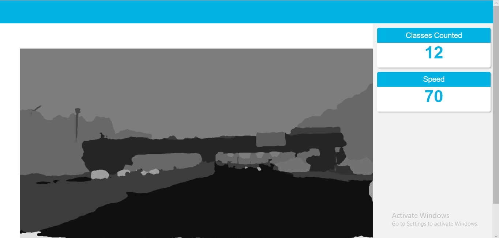

# Vehicle-Edge-Application

| Details            |              |
|-----------------------|---------------|
| Programming Language: |  Python 3.5 or 3.6 |



## What it Does

The vehicle counter application will demonstrate how to create a smart video IoT solution using Intel® hardware and software tools. The app will detect people, vehicle in a designated area, providing the number of frame, average duration of vehicle in frame, and total count.

## Requirements

### Hardware

* 6th to 10th generation Intel® Core™ processor with Iris® Pro graphics or Intel® HD Graphics.
* OR use of Intel® Neural Compute Stick 2 (NCS2)
* OR Udacity classroom workspace for the related course

### Software

*   Intel® Distribution of OpenVINO™ toolkit 2019 R3 release
*   Node v6.17.1
*   Npm v3.10.10
*   CMake
*   MQTT Mosca server
  
        
## Setup

### Install Intel® Distribution of OpenVINO™ toolkit

Utilize the classroom workspace, or refer to the relevant instructions for your operating system for this step.

- [Linux/Ubuntu](./linux-setup.md)
- [Mac](./mac-setup.md)
- [Windows](./windows-setup.md)

## Run the application

From the main directory:

### Step 1 - Start the Mosca server

```
cd webservice/server/node-server
node ./server.js
```

You should see the following message, if successful:
```
Mosca server started.
```

### Step 2 - Start the GUI

Open new terminal and run below commands.
```
cd webservice/ui
npm run dev
```

You should see the following message in the terminal.
```
webpack: Compiled successfully
```

### Step 3 - FFmpeg Server

Open new terminal and run the below commands.
```
sudo ffserver -f ./ffmpeg/server.conf
```

### Step 4 - Run the code

Open a new terminal to run the code. 

#### Setup the environment

You must configure the environment to use the Intel® Distribution of OpenVINO™ toolkit one time per session by running the following command:
```
source /opt/intel/openvino/bin/setupvars.sh -pyver 3.5
```
#### Running the App
To run the app itself, with the UI server, MQTT server, and FFmpeg server also running, do:

```
python app.py | ffmpeg -v warning -f rawvideo -pixel_format bgr24 -video_size 1280x720 -framerate 24 -i - http://0.0.0.0:3004/fac.ffm```
